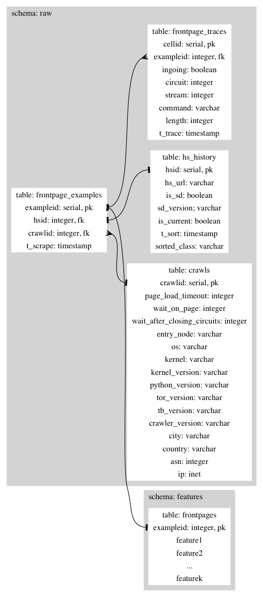

# FingerprintSecureDrop

The code herein can be used to collect Tor cell traces, which can be used to
train classifiers to website fingerprint SecureDrop (SD) instances. The idea is
to use this as a way to test server-side defense mitigations we hope to
implement. If you're interested in website fingerprinting and defenses
(especially in relation to Tor), please feel encouraged to come talk with a
group of researchers in a Gitter chatroom at
https://gitter.im/freedomofpress/Website_Fingerprinting. 

We're hoping to the code in this repo a little more composable soon, so you can
make some modifications to get this going for your own onion service (or perhaps
even regular site). Until then, you could still try it out on SecureDrop, and
then analyze the traces with your favorite classifiers. If you do so, please
share your results with us! (Preferably, using PGP.)

`sort_onions.py` first scrapes onion service URLs from some popular onion
service indexes, and then scrapes each of those .onion URLs. If it encounters an
up-to-date SD, it stores it as such. If it encounters a site that doesn't
mention SD at all, it also stores that URL in a different set. These are the two
sets that really matter (i.e., are used by `crawl_onions.py`). Out-of-date SDs
could mess with our results (shame on you admins ;-P), and we also ignore sites
that even mention SD as a precaution against sites like Greenpeace's heavily
modified, very out-of-date SecureDrop that they seem to have rebranded as
"SafeSource," but fortunately still includes the string "SecureDrop" on the
homepage. Thus we can catch it with this precautionary measure. Hopefully, no
sites have made minor changes to SecureDrop and also dropped mention of
SecureDrop, because that would have potential to mess up our results. I believe
that's probably unlikely.

`crawl_onions.py` crawls onion services roughly following Tao and Goldberg (see
https://cypherpunks.ca/~iang/pubs/webfingerprint-wpes.pdf, Appendix A, Algorithm
1). Collecting a trace for a single site happens roughly as follows:

* Load single onion service in Tor Browser (using a virtual framebuffer for
    headless operation by default)
* Wait 5 (configurable) seconds after the initial page onload event to capture
    traffic after the initial onload event
* Use stem to identify the unique, singular Tor circuit id for the rendezvous
    circuit to meet the onion service we're loading
* Read the Tor cell log from our modified `tor` binary and collects all DATA
    cells from that circuit id
    * Write these as `(time, direction)` pairs in a file on disk, adjusted so
        the first cell is time zero
* Close all circuits with stem
* Pause 5s (we're currently experimenting with this value to see if it's
  necessary and how it affects our results)

The adversary model we are assuming is as follows. First, our adversary is in
control of our guard node. Thus, they are able to separate individual streams
(rendezvous circuits are actually not multiplexed within TCP streams like
general circuits, but I mention this because it's relevant to general circuits,
which are multiplexed). Second, our adversary has read Kwon et. al's circuit
fingerprint paper (see
https://www.usenix.org/system/files/conference/usenixsecurity15/sec15-paper-kwon.pdf)
and is capable of fingerprinting our rendezvous circuits with 100% accuracy. The
way we collect traces described above is representative of the capabilities of
such an adversary.

We have begun to use a fixed entry node because it seems that a malicious actor
in control of one or more guard nodes would train a separate classifier on each
guard node for fingerprinting the traffic that goes through that guard node.
Training on data produced under the same network conditions as you would wish to
perform real-world attacks should produce more accurate results.

Lastly, `config.ini` is a general configuration file, for those who just want to
run the script and tinker with some parameters. This should be expanded in the
future to expose even more functionality and make it easy to swap out your own
website for SD in order to test fingerprinting defenses on your own hidden
service.

## Getting Started

Make sure you have installed the latest stable versions of Vagrant and
Virtualbox. Then run:

```
$ mkvirtualenv -p python2 fpsd
(fpsd)$ pip install -U -r requirements/requirements.txt
```

To get a properly configured VM bootstrapped for crawling, run:

```
cd FingerprintSecureDrop
vagrant up
```

We seriously recommend using the Vagrantfile and Ansible playbook, which will
sping up a VM and provision it for you, it is not strictly necessary. A lot of
things are necessary to get this to work otherwise including compiling a custom
version of Tor. We will not be providing instructions for how to do this, but
the patched `relay.c` is here and everything you'd need to do to get this code
running can be figured out by reading through the Ansible playbook.

### Running the Sorter

```
vagrant ssh
cd ~/FingerprintSecureDrop/fpsd
./sorter.py
```

To look at the sorter log while it's running run `less +F
logging/sorter-latest.log`. Sorter data will be timestamped with
`logging/class-data-latest.pickle` being symlinked to the latest data
(timestamping and symlinking like this is done with all logs and data files that
are created by the Python processes in this repo).

### Running the Crawler

```
vagrant ssh
cd ~/FingerprintSecureDrop/fpsd
./crawler.py
```

To look at the crawler log while it's running run `less +F
logging/crawler-latest.log`, and to look at the raw Tor cell log run `less +F
logging/tor_cell_seq.log`. You can also check out the traces it's collecting as
it runs: `cd logging/batch-latest`.

A systemd unit is also provided to run the crawler on repeat. Simply run
`systemctl start crawler@<your username>.service` to start the crawler running
on repeat.

### Using PostgreSQL for data storage and queries

The data collection programs—the sorter and crawler—are integrated with a
PostgreSQL database. When the `use_database` option is set to `True` in the
`[sorter]` section of `fpsd/config.ini`, the sorter will save its sorted onion
addresses in the database. When the `use_database` option is set to `True` in
the `[crawler]` section of `fpsd/config.ini`, the crawler will grab onions from
the database, connect to them, record traces, and store them back in the
database.

By default, during provisioning of the VM, a PostgreSQL database is setup.
Currently, our own schemas are used to set up the database, and we have not yet
generalized the code that would allow you to create and interact with your own
schemas. If you wish to use a remote database, you are encouraged to set
`fpsd_initialize_local_db` to `false` in `roles/database/defaults/main.yml`, and
to fill out `fpsd_database_psql_env` (in that same file) with the necessary
information to connect to this remote database (again, for now this remote
database must be set up with our schemas).  If you wish not to use any database
at all set the environment variable `ANSIBLE_ARGS="--skip-tags=database"` when
provisioning.

By default, when provisioning a database password will be generated for you
automatically and will be saved to `/tmp/passwordfile` on the Ansible
controller, and saved to a `PGPASSFILE`, `~{{ ansible_user }}/.pgpass`, on the
remote host. Environment variables are also be set such that you should be able
to simply issue the command `psql` with no arguments to connect and authenticate
to your database, and enter its interactive terminal.

#### Database Design

We store the raw data in the `raw` schema and the derived features in the
`features` schema. The sorter writes to `raw.hs_history`, inserting one row per
sorted onion address. The crawler reads from `raw.hs_history` and writes one row
per crawl session to `raw.crawls`, one row per trace to
`raw.frontpage_examples`, and one row per cell in the trace to
`raw.frontpage_traces`. 

The current design of the database is shown in the following figure:



### Deploying to remote servers

Todo: write
