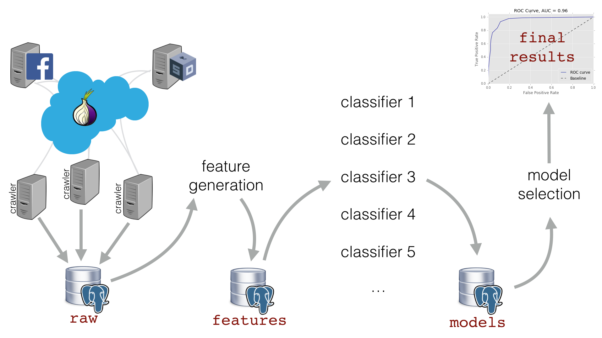
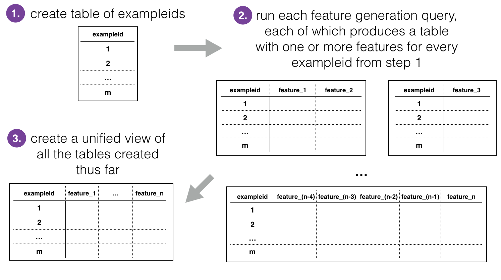

# Web Fingerprinting Analysis Pipeline



## Feature Generation

Our feature generation code is primarily in SQL and takes data the crawlers dump into the `raw` schema, generates all features relevant to Tor traffic from Wang et al. 2014, and stores the results in the `features` schema:



Run this step with:

```python features.py```

## Machine Learning

This step:

* takes the features in the database, 
* trains a series of binary classifiers, 
* evaluates how well each classifier performs, 
* and then saves performance metrics in the database as well as pickling the trained model objects (for use in future scoring)

Run this step with:

```python attack.py -a my_attack_file.yaml``` 

### Attack Setup

The machine learning part of the code takes a YAML file (by default `attack.yaml`) as input to specify details of the models that should be generated. Here are the options that are currently implemented:

* `world`: specifies what kind of cross validation should be performed.
   * `type`: `closed` or `open`
   * `observed_fraction`: specifies the fraction of the world that is "observed" (measured by the adversary) for open world validation. 

* `num_kfolds`: value of k for k-fold cross-validation 

* `feature_scaling`: this option will take the features and rescale them to a zero mean and unit standard deviation. For some classifiers, e.g. primarily those based on decision trees, this should not improve performance, but for many classifiers, e.g. SVM, this is necessary. 

* `models`: a list of types of binary classifiers that should be trained

* `parameters`: this option specifies the range of hyperparameters that should be used for each classifier type

For more details and examples, see `attack.yaml` as an example.

### Model Training and Evaluation

When this step of the pipeline runs, it will:

* get the features from the database,
* split the data into train/test sets,
* generate a series of experiments to be run that tries every  possible combination of preprocessing option, model type and hyperparameter set
* for each experiment:
	* for every train/test split, it will:
		* train on the training set, 
		* evaluate on the testing set, 
		* save the metrics in the database in  `models.undefended_frontpage_folds`,
		* pickle the trained model and save for future scoring
	* average the metrics for the folds from that experiment and save them in the database in `models.undefended_frontpage_attacks`.

### Evaluation and Output in Model Schema

The information and evaluation metrics stored in the database in table `models.undefended_frontpage_folds`:

* `auc`: [Area under the ROC curve](http://people.inf.elte.hu/kiss/12dwhdm/roc.pdf)
* `tpr`: true positive rate [array for default sklearn thresholds]
* `fpr`: false positive rate [array for default sklearn thresholds]
* `precision_at_k` for `k=[0.01, 0.05, 0.1, 0.5, 1, 5, 10]`: "Fraction of SecureDrop users correctly identified in the top k percent"
* `recall_at_k` for `k=[0.01, 0.05, 0.1, 0.5, 1, 5, 10]`: "Number of SecureDrop users captured by flagging the top k percent" 
* `f1_at_k` for `k=[0.01, 0.05, 0.1, 0.5, 1, 5, 10]` 

The same metrics are then computed over all folds and saved in `models.undefended_frontpage_attacks`, in addition to:

* `world_type`
* `train_class_balance`
* `base_rate` (test class balance)
* `observed_world_size` if in open world validation
* `model_type`
* `hyperparameters` in json format

The `model_timestamp` and `fold_timestamp` are saved as identifiers in `models.undefended_frontpage_folds` and the `model_timestamp` is saved in `models.undefended_frontpage_attacks`.

## Model Selection

This is currently done manually by selecting the top `auc` model in the database. 